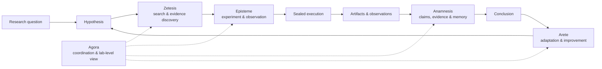
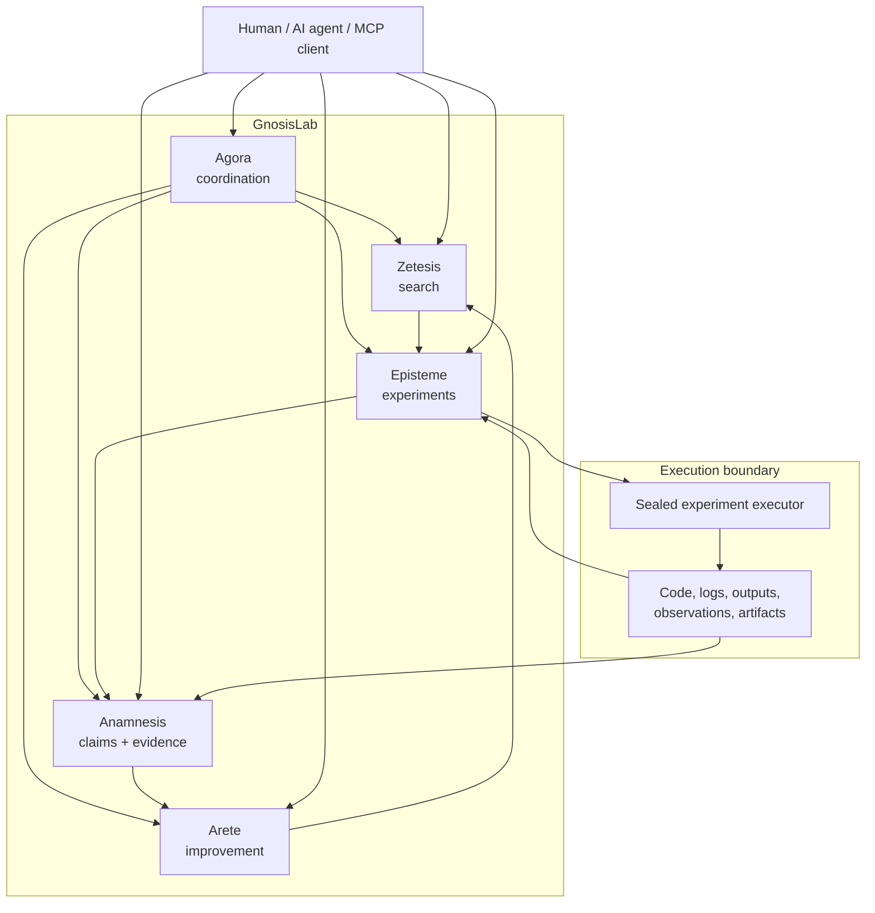

<!-- markdownlint-disable MD033 MD041 MD001 -->
<div align="center">

# GnosisLab

### A scientific-method runtime for AI agents

**Turn hypotheses into experiments, experiments into evidence, and evidence into auditable conclusions.**

[](https://github.com/cloudcell/gnosislab/actions/workflows/ci.yml)
[](https://pypi.org/project/gnosislab/)
[](https://pypi.org/project/gnosislab/)
[](LICENSE)
[](https://www.piwheels.org/project/gnosislab/)
[](/packages/gnosislab)
[](https://discord.com/invite/v9JVtpVuUT)

[Install](#quick-start) · [Documentation](https://loop.cloudcell.workers.dev/docs) · [How it works](#how-it-works) · [Architecture](#architecture) · [For researchers](#for-researchers) · [For developers](#for-developers) · [Discord](https://discord.gg/v9JVtpVuUT)

</div>

---

## What is GnosisLab?

Most AI agents are optimized to **produce an answer**.

GnosisLab is built to help an agent **produce a defensible result**.

It turns the scientific process into explicit software objects:

> **hypothesis → experiment → observation → evidence → claim → conclusion**

Instead of leaving an agent's reasoning, experiments, and evidence scattered across prompts, shell history, notebooks, logs, and temporary files, GnosisLab gives the process a structured runtime.

Experiments are represented explicitly. Evidence is retained. Claims can be connected to their support. Execution is observable. State is separated by responsibility. The resulting research process can be inspected by a human rather than accepted as an opaque final answer.

GnosisLab is intended for machine-learning experimentation, computational research, autonomous research agents, evaluation systems, and other workflows where **how a result was obtained matters as much as the result itself**.

---

## Why this exists

LLMs can generate code, search literature, run analyses, compare alternatives, and propose conclusions.

That creates a new problem:

**How do we know what actually happened?**

A useful research system needs more than tool access. It needs a disciplined process around tool use:

- What hypothesis was being tested?
- Which experiment addressed it?
- What code actually ran?
- What observations were produced?
- Which evidence supports which claim?
- Which conclusions remain uncertain?
- What changed between one iteration and the next?
- Can a human inspect the path from question to result?

GnosisLab makes those questions part of the system itself.

---

## Quick start

### Install from PyPI

```bash
uv tool install gnosislab
```

or:

```bash
pip install gnosislab
```

Then start the full stack:

```bash
gnosislab start all
```

Check it:

```bash
gnosislab status
```

Inspect resolved configuration:

```bash
gnosislab config
```

Stop it:

```bash
gnosislab stop all
```

**Full documentation:** <https://loop.cloudcell.workers.dev/docs>

### Install from source

```bash
git clone https://github.com/cloudcell/gnosislab.git
cd gnosislab
uv sync
./gnosislab start all
```

> **Linux is currently required for sealed trial execution.**  
> The executor uses `bubblewrap` mount namespaces and `strace`.

On Debian/Ubuntu:

```bash
sudo apt install bubblewrap strace
```

---

## The idea in one picture



The point is not the Greek names. The point is **separation of scientific responsibilities**.

Each subsystem owns a distinct part of the research process rather than collapsing everything into one agent loop and one unstructured memory.

---

## How it works

GnosisLab is composed of five MCP services.

| Service | Role | Think of it as |
| --- | --- | --- |
| **Episteme** | experiments, trials, observations and experimental state | the laboratory notebook |
| **Anamnesis** | claims, evidence relationships and persistent research memory | the evidence graph |
| **Zetesis** | search, investigation campaigns and evidence discovery | the investigator |
| **Arete** | improvement, comparison and meta-level adaptation | the critic / improver |
| **Agora** | coordination and lab-level observability | the control room |

The services deliberately keep their state boundaries separate. This makes ownership clearer, failures easier to isolate, schemas easier to evolve, and each subsystem independently inspectable.

---

## Architecture



### Default service ports

| Service | GUI | MCP |
| --- | ---: | ---: |
| Agora | `38051` | `38050` |
| Arete | `38061` | `38060` |
| Zetesis | `38071` | `38070` |
| Episteme | `38081` | `38080` |
| Anamnesis | `38091` | `38090` |

Defaults can be overridden with:

```text
~/.config/gnosislab/ports.env
```

or the corresponding `ML_*` environment variables.

Runtime state lives outside the repository under:

```text
~/.ml-<name>/
```

---

## For researchers

GnosisLab is designed around a simple principle:

> **A scientific result should remain inspectable after the agent that produced it has moved on.**

That means treating research state as durable data rather than transient conversation context.

### Explicit experimental structure

Research can be represented in terms of programmes, trials, observations, evidence and claims rather than buried inside a chat transcript.

### Provenance

The system is designed to retain the relationship between experimental actions, artifacts, observations, evidence and downstream claims.

### Reproducibility

Experiment execution is separated from conversational reasoning. The aim is to preserve the material needed to understand and reproduce what was actually done.

### Human review

GnosisLab is not built around the assumption that an autonomous agent should be trusted by default. Its structure is intended to make intermediate state visible enough for review, correction and override.

### Uncertainty belongs in the record

A research system should distinguish a claim from the evidence supporting it and should avoid turning an agent's confidence into an unexplained magic number.

---

## For developers

GnosisLab is infrastructure, not a monolithic chatbot.

### MCP-native

The distribution exposes five MCP server entry points:

```text
ml-episteme-mcp
ml-anamnesis-mcp
ml-zetesis-mcp
ml-arete-mcp
ml-agora-mcp
```

This means an MCP-capable agent or client can work with the scientific process as a set of tools rather than requiring a proprietary frontend.

### One command for lifecycle management

```bash
gnosislab start all
gnosislab status
gnosislab logs arete
gnosislab stop all
```

### Sealed experiment execution

Trial execution uses Linux isolation primitives so experiments can run inside a constrained boundary rather than directly in the agent's host environment.

### Observable by design

Every service exposes a local observability GUI. You can inspect the system while it is operating instead of treating agent activity as an invisible background process.

### Separate state ownership

The major research loops keep their own persistent stores. This avoids turning one shared database into an ambiguous write boundary and lets each service evolve independently.

### Small dependency surface

The published package targets Python 3.10+ and keeps the core runtime dependency set focused around MCP, Pydantic and HTTPX.

---

## A research loop, expressed as software

A conventional agent loop often looks roughly like this:

```text
prompt → tool calls → more prompting → answer
```

GnosisLab makes the scientific structure explicit:

```text
question
  ↓
hypothesis
  ↓
search / prior evidence
  ↓
experiment design
  ↓
sealed execution
  ↓
observations + artifacts
  ↓
evidence-linked claims
  ↓
conclusion
  ↓
critique / adaptation
  ↓
next hypothesis
```

That difference matters when the work is long-running, iterative, expensive, safety-sensitive, or intended to survive peer review.

---

## What GnosisLab is not

GnosisLab is **not**:

- a replacement for a capable language model;
- a claim that autonomous agents can replace scientific judgment;
- a generic vector-memory wrapper;
- a single prompt that tells an LLM to "act like a scientist";
- an opaque autonomous system that asks you to trust the final answer.

It is an attempt to make the **process around AI-assisted research explicit, inspectable and programmable**.

---

## Example use cases

### Machine-learning research

An agent can propose an architecture change, execute a controlled trial, capture metrics and artifacts, attach evidence to the resulting claim, and use the result to choose the next experiment.

### Reproducible benchmarking

Benchmark runs can be treated as experiments with explicit observations rather than as disconnected terminal commands and copied numbers.

### Literature-to-experiment workflows

Search and evidence discovery can feed hypotheses and experimental design while keeping source evidence distinct from experimentally generated evidence.

### Long-running autonomous investigation

The system can preserve research state across many agent turns without relying on a single ever-growing context window.

### Human-supervised research agents

A researcher can inspect intermediate claims, evidence, trial outcomes and service state rather than reviewing only a final generated report.

---

## Project layout

```text
gnosislab/
├── src/                # gnosislab CLI + five ml_*_mcp packages
├── tests/              # test suite (pytest-xdist)
├── constants/          # grounded-constants registry + disclosure
├── diagnostics/        # diagnostics corpus
├── gnosislab           # lifecycle CLI entry point
├── labloop             # transition compatibility symlink
├── ml-*.toml           # per-server config
├── ports.env           # port assignments
├── pyproject.toml      # distribution metadata
├── LICENSE
├── NOTICE
└── README.md
```

The repository root is the runnable project:

```bash
uv sync
```

---

## Configuration

Per-service configuration lives under:

```text
ml-*.toml
```

Port configuration:

```text
ports.env
```

User overrides:

```text
~/.config/gnosislab/ports.env
```

Inspect the resolved configuration at any time:

```bash
gnosislab config
```

---

## Observability

After startup, each service exposes a local GUI.

For example:

```text
Agora      http://localhost:38051
Arete      http://localhost:38061
Zetesis    http://localhost:38071
Episteme   http://localhost:38081
Anamnesis  http://localhost:38091
```

Use:

```bash
gnosislab status
```

for process, port and health information.

Use:

```bash
gnosislab logs <service>
```

to inspect a service directly.

---

## Testing

Run the full suite:

```bash
uv run pytest -q
```

The repository currently contains **1,289 tests**.

For a serial run:

```bash
uv run pytest -n0
```

---

## Development status

GnosisLab is **alpha software**.

The architecture is usable and the package is published, but interfaces, schemas and internal boundaries may continue to evolve.

If you are evaluating it for serious research, inspect the code, test the failure modes, and treat the current release as research infrastructure under active development.

---

## Install and explore

```bash
uv tool install gnosislab
gnosislab start all
gnosislab status
```

Documentation: <https://loop.cloudcell.workers.dev/docs>

PyPI: <https://pypi.org/project/gnosislab/>

Repository: <https://github.com/cloudcell/gnosislab>

---

## Contributing

GnosisLab is most useful when challenged by people who care about scientific rigor, agent engineering, reproducibility, provenance, evaluation and research infrastructure.

Useful contributions include:

- adversarial testing of the scientific state machine;
- new experiment and evidence workflows;
- integrations with MCP clients and research agents;
- reproducibility and provenance improvements;
- better observability;
- failure-mode documentation;
- benchmark suites;
- documentation and examples.

Open an issue with a concrete failure case, proposed experiment, or implementation idea.

---

## Philosophy

AI makes it dramatically cheaper to generate hypotheses, code, analyses and prose.

It does **not** automatically make those outputs scientific.

The difficult part is preserving the chain between:

**what was proposed → what was done → what was observed → what counts as evidence → what may reasonably be concluded**

GnosisLab exists to make that chain a first-class object.

---

## License

Apache License 2.0. See [`LICENSE`](LICENSE).

---

<div align="center">

### Make the experiment part of the program.

**GnosisLab**

<https://github.com/cloudcell/gnosislab>

</div>
